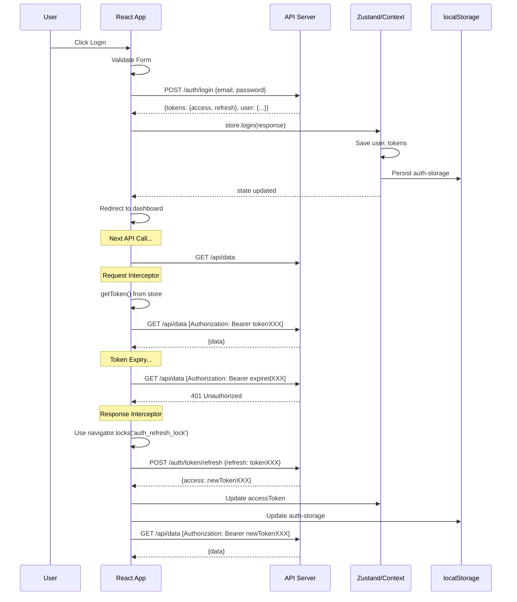
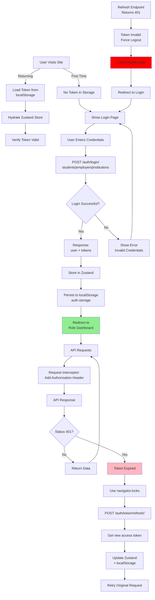

# Frontend Authentication & Role-Based Access Control - Comprehensive Analysis

**Date**: April 10, 2026  
**Scope**: React/TypeScript Frontend (`edulink-frontend/`)  
**Status**: ⚠️ Multiple critical issues found requiring immediate attention

---

## EXECUTIVE SUMMARY

The frontend implements a **multi-portal authentication system** with separate contexts for regular users (Student/Employer/Institution) and admin users (System Admin). While the architecture provides good separation between portals, there are **critical bugs in token storage key mismatches**, **frontend-only access control without backend validation**, and **inconsistent service usage patterns** that pose security risks.

### Key Findings
- ✅ **Good**: Zustand state management with localStorage persistence
- ✅ **Good**: Proper token refresh with cross-tab synchronization
- ❌ **CRITICAL**: AdminRouteGuards checks for non-existent `adminRole` key (file: [src/components/admin/AdminRouteGuards.tsx](src/components/admin/AdminRouteGuards.tsx))
- ❌ **CRITICAL**: PendingAffiliations component retrieves wrong localStorage key (file: [src/components/admin/PendingAffiliations.tsx](src/components/admin/PendingAffiliations.tsx))
- ⚠️ **HIGH**: Frontend-only role checks don't prevent API access (example: [src/pages/Opportunities.tsx](src/pages/Opportunities.xyz))

---

## 1. AUTHENTICATION ARCHITECTURE

### System Overview

```
┌─────────────────────────────────────────────────────────────────┐
│                    EDULINK FRONTEND AUTH                        │
├─────────────────────────────────────────────────────────────────┤
│                                                                   │
│  ┌──────────────────────┐        ┌──────────────────────┐       │
│  │   Regular Users      │        │    Admin Users       │       │
│  │  (Student/Employer/  │        │  (System Admin)      │       │
│  │   Institution)       │        │                      │       │
│  └──────────────┬───────┘        └──────────┬───────────┘       │
│                 │                           │                   │
│         ┌───────▼──────────┐       ┌────────▼──────────┐       │
│         │  Zustand Store   │       │  AdminAuthContext │       │
│         │  (authStore.ts)  │       │  + localStorage   │       │
│         └────────┬─────────┘       └────────┬──────────┘       │
│                  │                          │                   │
│    ┌─────────────▼────────────────────────────────┐            │
│    │        localStorage                         │            │
│    │  ┌──────────────────────────────────────┐   │            │
│    │  │ auth-storage: {                      │   │            │
│    │  │   user, accessToken,                 │   │            │
│    │  │   refreshToken, isAuthenticated      │   │            │
│    │  │ }                                    │   │            │
│    │  └──────────────────────────────────────┘   │            │
│    │  ┌──────────────────────────────────────┐   │            │
│    │  │ adminToken: "jwt..."                 │   │            │
│    │  │ adminUser: {...}                     │   │            │
│    │  │ adminRefreshToken: "jwt..."          │   │            │
│    │  └──────────────────────────────────────┘   │            │
│    └─────────────┬─────────────────────────────────┘            │
│                  │                                              │
│         ┌────────▼────────────────┐                            │
│         │   API Client            │                            │
│         │   (axios + interceptors)│                            │
│         │   - Request decorator   │                            │
│         │   - 401 auto-refresh    │                            │
│         │   - Cross-tab sync      │                            │
│         └────────┬────────────────┘                            │
│                  │                                              │
│    ┌─────────────▼───────────────────────────┐                │
│    │         Backend API Servers              │               │
│    │  /students/auth/login                    │               │
│    │  /employers/auth/login                   │               │
│    │  /institutions/auth/login                │               │
│    │  /admin/auth/login                       │               │
│    └─────────────────────────────────────────┘                │
│                                                                   │
└─────────────────────────────────────────────────────────────────┘
```

### Token Flow



---

## 2. AUTHENTICATION LAYER ANALYSIS

### Token Storage & Management

| Aspect | Location | Method | Issue |
|--------|----------|--------|-------|
| **User Token** | Zustand Store | `authStore.ts` - `persist` middleware | ✓ Good |
| **User Token Backup** | localStorage | Key: `auth-storage` (JSON) | ✓ Centralized |
| **Admin Token** | AdminAuthContext | Direct localStorage | ⚠️ Separate system |
| **Admin Token Key** | localStorage | `adminToken` | ⚠️ Not standardized |
| **Refresh Token (User)** | Zustand Store | Persisted with access token | ✓ Good |
| **Refresh Token (Admin)** | localStorage | `adminRefreshToken` | ⚠️ Separate |
| **API Client Cache** | In-Memory | `private accessToken: string` | ✓ Fast access |

**Files**:
- Store: [src/stores/authStore.ts](src/stores/authStore.ts#L1-L50)
- Context: [src/contexts/AuthContext.tsx](src/contexts/AuthContext.tsx#L30-L80)
- Admin Context: [src/contexts/AdminAuthContext.tsx](src/contexts/AdminAuthContext.tsx#L44-L70)
- API Client: [src/services/api/client.ts](src/services/api/client.ts#L185-L220)

### Login/Logout Workflow

#### Login Flow

```typescript
// 1. User submits form (Login.tsx or SystemAdminLogin.tsx)
const handleLoginSubmit = async (email: string, password: string) => {
  try {
    // 2. Call appropriate auth service
    await store.login(credentials);  // Regular user
    // OR
    await adminAuth.login(credentials);  // Admin
    
    // 3. Service makes API call
    // authService.login() → POST /api/students/auth/login/
    // adminAuthService.login() → POST /api/admin/auth/login/
    
    // 4. Response handler
    // authStore: saves to Zustand + localStorage('auth-storage')
    // adminAuth: saves to localStorage + context state
    
    // 5. Redirect
    navigate('/dashboard/student');  // or appropriate route
    
  } catch (error) {
    showError(getLoginErrorMessage(error));
  }
};
```

**Files**:
- Student Login: [src/pages/auth/Login.tsx](src/pages/auth/Login.tsx#L200-L250)
- Admin Login: [src/pages/admin/SystemAdmin/SystemAdminLogin.tsx](src/pages/admin/SystemAdmin/SystemAdminLogin.tsx#L50-L100)
- Services: [src/services/auth/authService.ts](src/services/auth/authService.ts#L60-L140)

#### Logout Flow

```typescript
// 1. User clicks logout
const handleLogout = () => {
  // 2. Clear store/context
  store.logout();  // Clears Zustand
  // OR
  adminAuth.logout();  // Clears AdminAuthContext

  // 3. Clear localStorage
  // authStore: clears 'auth-storage'
  // adminAuth: clears 'adminToken', 'adminUser', 'adminRefreshToken'
  
  // 4. Clear API client state
  apiClient.clearAuth();
  
  // 5. Redirect
  navigate('/login');
};
```

### Session/Token Validation Logic

#### Initialization (App Mount)
```typescript
// authStore.ts uses Zustand persist middleware
// On app load, automatically hydrates from localStorage if present
export const useAuthStore = create<AuthState>()(
  persist(
    (set, get) => ({ ... }),
    { 
      name: 'auth-storage',
      storage: createJSONStorage(() => localStorage),
    }
  )
);

// AdminAuthContext.tsx manually hydrates
useEffect(() => {
  const storedToken = localStorage.getItem('adminToken');
  const storedAdmin = localStorage.getItem('adminUser');
  if (storedToken && storedAdmin) {
    setToken(storedToken);
    setAdmin(JSON.parse(storedAdmin));
  }
  setIsLoading(false);
}, []);
```

#### Token Refresh
```typescript
// API Client intercepts 401 responses
private async refreshToken(): Promise<void> {
  // Use navigator.locks for cross-tab coordination
  if (navigator.locks) {
    await navigator.locks.request('auth_refresh_lock', async () => {
      // Check if admin or regular user
      if (localStorage.getItem('adminToken')) {
        // Admin refresh: POST /api/admin/auth/token/refresh/
        const response = await this.client.post('/api/admin/auth/token/refresh/', ...);
        localStorage.setItem('adminToken', response.access);
      } else {
        // User refresh: POST /api/auth/token/refresh/
        const response = await this.client.post('/api/auth/token/refresh/', ...);
        // Update store via callback pattern
        this.onTokenUpdate?.(response.access, response.refresh);
      }
    });
  }
}
```

**Files**:
- API Client Refresh: [src/services/api/client.ts](src/services/api/client.ts#L220-L280)
- Store Refresh: [src/stores/authStore.ts](src/stores/authStore.ts#L140-L180)

---

## 3. ROLE MANAGEMENT ANALYSIS

### Role Definition & Storage

```typescript
// User Roles (types/index.ts)
export type User {
  role: 'student' | 'employer' | 'institution' | 'institution_admin' | 
        'employer_admin' | 'supervisor' | 'system_admin'
}

// Admin Roles (AdminAuthContext.tsx)
export type AdminUser {
  role: 'SUPER_ADMIN' | 'PLATFORM_ADMIN' | 'MODERATOR' | 'AUDITOR'
}
```

### Role Determination

| Role | Determined By | Source | Time |
|------|---------------|--------|------|
| Student | Login endpoint | Backend response | Login |
| Employer | Login endpoint | Backend response | Login |
| Institution | Login endpoint | Backend response | Login |
| Institution Admin | Login endpoint | Backend response | Login |
| Employer Admin | Login endpoint | Backend response | Login |
| Supervisor | Login endpoint | Backend response | Login |
| System Admin | Admin login endpoint | Backend response | Login |

**Persistence**: Saved in `user.role` field within Zustand store or AdminAuthContext

### Role Storage Pattern

```javascript
// Regular User - Zustand (authStore.ts)
localStorage.setItem('auth-storage', JSON.stringify({
  state: {
    user: {
      id: "uuid",
      email: "student@example.com",
      firstName: "John",
      lastName: "Doe",
      role: "student",  // ← ROLE HERE
      trustLevel: 5,
      institution_id: "uuid",
      avatar: "url"
    },
    accessToken: "eyJ...",
    refreshToken: "eyJ...",
    isAuthenticated: true
  },
  version: 0
}));

// Admin User - Direct localStorage (AdminAuthContext.tsx)
localStorage.setItem('adminToken', 'eyJ...');
localStorage.setItem('adminUser', JSON.stringify({
  id: "uuid",
  email: "admin@example.com",
  role: "SUPER_ADMIN",  // ← ROLE HERE (WARNING: also stored as platform_staff_role)
  permissions: ["user_management", "institution_management"],
  createdAt: "2026-04-01",
  lastLogin: "2026-04-10"
}));
```

**Files**:
- Types: [src/types/index.ts](src/types/index.ts#L1-L20)
- Store: [src/stores/authStore.ts](src/stores/authStore.ts#L5-L25)
- Admin Context: [src/contexts/AdminAuthContext.tsx](src/contexts/AdminAuthContext.tsx#L10-L30)

---

## 4. AUTHORIZATION & ACCESS CONTROL ANALYSIS

### Protected Routes Implementation

#### ProtectedRoute Component (Regular Users)

```typescript
// src/routes/index.tsx
export const ProtectedRoute: React.FC<{ children: React.ReactNode, role?: string | string[] }> = 
  ({ children, role }) => {
    const { isAuthenticated, user } = useAuthStore();
    const location = useLocation();
    
    // Step 1: Check authentication
    if (!isAuthenticated) {
      // Smart redirect based on location
      if (location.pathname.startsWith('/institution')) {
        return <Navigate to="/institution/login" />;
      } else if (location.pathname.startsWith('/employer')) {
        return <Navigate to="/employer/login" />;
      }
      return <Navigate to="/login" />;
    }
    
    // Step 2: Check role (if specified)
    if (role && user) {
      const roles = Array.isArray(role) ? role : [role];
      if (!roles.includes(user.role)) {
        // Redirect to their own dashboard
        return <Navigate to={getDashboardPath(user.role)} />;
      }
    }
    
    return <>{children}</>;
};
```

**Usage**:
```typescript
{
  path: ROUTES.STUDENT_DASHBOARD,
  element: (
    <ProtectedRoute>
      <StudentDashboard />
    </ProtectedRoute>
  ),
},
```

**File**: [src/routes/index.tsx](src/routes/index.tsx#L50-L100)

#### AdminProtectedRoute Component (Admin Users)

```typescript
// src/components/admin/AdminRouteGuards.tsx - HAS BUGS!
export const AdminProtectedRoute: React.FC<{ children: React.ReactNode }> = ({ children }) => {
  const adminToken = localStorage.getItem('adminToken');
  const adminRole = localStorage.getItem('adminRole');  // ❌ BUG: Never stored!
  
  if (!adminToken || !adminRole) {
    return <Navigate to="/admin/login" />;
  }
  
  const validAdminRoles = ['SUPER_ADMIN', 'PLATFORM_ADMIN', 'MODERATOR', 'AUDITOR'];
  if (!validAdminRoles.includes(adminRole)) {
    return <Navigate to="/admin/login" />;
  }
  
  return <>{children}</>;
};
```

**Issues**:
1. ❌ Looks for `adminRole` key that's **never stored** in localStorage
2. ⚠️ Role is stored inside `adminUser` JSON (need to parse it)
3. ⚠️ No role verification logic beyond string matching

**File**: [src/components/admin/AdminRouteGuards.tsx](src/components/admin/AdminRouteGuards.tsx#L1-L35)

### Component-Level Role Checks

#### Pattern 1: Hardcoded Role Validation (Frontend-Only)

```typescript
// src/pages/Opportunities.tsx
const initiateApply = (opportunity: InternshipOpportunity) => {
  if (!user) {
    setShowLoginModal(true);
    return;
  }
  
  if (user.role !== 'student') {  // ❌ Frontend check only!
    toast.error('Only students can apply for internships');
    return;
  }
  
  setSelectedOpportunity(opportunity);
  setShowApplyModal(true);
};
```

**Issues**:
- ✅ User sees correct error message
- ❌ **Doesn't prevent API call** - backend must enforce
- ❌ Not centralized - duplicated in [src/pages/OpportunityDetails.tsx](src/pages/OpportunityDetails.tsx#L54)

**Files**:
- [src/pages/Opportunities.tsx](src/pages/Opportunities.tsx#L120-L130)
- [src/pages/OpportunityDetails.tsx](src/pages/OpportunityDetails.tsx#L54-L65)

#### Pattern 2: Dynamic Layout Selection

```typescript
// src/components/layout/HybridLayout.tsx
const { user } = useAuth();

// Render different layout based on role
const renderDashboard = () => {
  switch (user.role) {
    case 'student':
      return <StudentLayout><StudentDashboard /></StudentLayout>;
    case 'employer':
      return <EmployerLayout><EmployerDashboard /></EmployerLayout>;
    case 'employer_admin':
      return <EmployerLayout><EmployerDashboard /></EmployerLayout>;
    case 'institution':
      return <InstitutionLayout><InstitutionDashboard /></InstitutionLayout>;
    case 'institution_admin':
      return <InstitutionLayout><InstitutionDashboard /></InstitutionLayout>;
    case 'supervisor':
      return <SupervisorLayout><SupervisorDashboard /></SupervisorLayout>;
    default:
      return <Navigate to="/login" />;
  }
};
```

**Files**: [src/components/layout/HybridLayout.tsx](src/components/layout/HybridLayout.tsx#L14-L30)

#### Pattern 3: Conditional Rendering Based on Role

```typescript
// Common pattern in supervisors/admin components
const { user } = useAuthStore();

const canReview = user?.role === 'supervisor' || user?.role === 'institution_admin';
const canManage = user?.role === 'institution_admin';

return (
  <>
    {canReview && <ReviewSection />}
    {canManage && <ManagementSection />}
  </>
);
```

### Route Configuration

```typescript
// src/routes/index.tsx - ROUTES object
export const ROUTES = {
  // Public
  HOME: '/',
  LOGIN: '/login',
  REGISTER: '/register',
  
  // Student (Protected)
  STUDENT_DASHBOARD: '/dashboard/student',
  STUDENT_APPLICATIONS: '/dashboard/student/applications',
  STUDENT_INTERNSHIPS: '/dashboard/student/internships',
  
  // Employer
  EMPLOYER_DASHBOARD: '/employer/dashboard',
  EMPLOYER_APPLICATIONS: '/employer/dashboard/applications',
  
  // Institution
  INSTITUTION_DASHBOARD: '/dashboard/institution',
  
  // Admin
  ADMIN_LOGIN: '/admin/login',
  ADMIN_DASHBOARD: '/admin',
  ADMIN_USERS: '/admin/users',
  
  // Supervisor
  SUPERVISOR_DASHBOARD: '/employer/supervisor',
  SUPERVISOR_LOGBOOKS: '/employer/supervisor/logbooks',
};
```

**File**: [src/routes/index.tsx](src/routes/index.tsx#L110-L200)

---

## 5. API INTEGRATION & SERVICE LAYER

### API Client Architecture

```typescript
// src/services/api/client.ts
class ApiClient {
  private client: AxiosInstance;        // Axios instance
  private accessToken: string | null;   // In-memory cache
  private isRefreshing: boolean;        // Refresh state flag
  private failedQueue: Array<...>;      // Queued requests during refresh
  
  // Methods
  setupInterceptors(): void      // Configure request/response
  private getToken()             // Get current token
  private getRefreshToken()      // Get refresh token
  private refreshToken()         // Handle token refresh
  private _performRefreshCall()  // Actual refresh API call
}
```

**Files**: [src/services/api/client.ts](src/services/api/client.ts)

### Request Interceptor

```typescript
// Adds Authorization header to all requests
this.client.interceptors.request.use((config) => {
  const token = this.getToken();
  const isAuthEndpoint = config.url?.includes('/login/') || 
                         config.url?.includes('/register/');
  const skipAuth = config.headers?.['skip-auth'];
  
  if (token && !skipAuth && !isAuthEndpoint) {
    config.headers.Authorization = `Bearer ${token}`;
  }
  
  return config;
});
```

### Response Interceptor (Auth Handling)

```typescript
this.client.interceptors.response.use(
  (response) => response,
  async (error: AxiosError) => {
    if (error.response?.status === 401) {
      if (this.isRefreshing) {
        // Queue request while refreshing
        return new Promise((resolve, reject) => {
          this.failedQueue.push({ resolve, reject, config: originalRequest });
        });
      }
      
      this.isRefreshing = true;
      try {
        await this.refreshToken();
        // Retry original request
        return this.client(originalRequest);
      } catch (error) {
        this.clearAuth();
        throw new AuthenticationError('Session expired');
      }
    }
  }
);
```

### Service Pattern Example

```typescript
// src/services/internship/internshipService.ts
class InternshipService {
  private client = apiClient;
  
  async getInternships(params?): Promise<InternshipOpportunity[]> {
    return this.client.get('/api/internships/', { params });
  }
  
  async applyForInternship(opportunityId: string, coverLetter?: string) {
    return this.client.post(`/api/internships/${opportunityId}/apply/`, {
      cover_letter: coverLetter
    });
  }
}
```

**Files**:
- [src/services/internship/internshipService.ts](src/services/internship/internshipService.ts)
- [src/services/student/studentService.ts](src/services/student/studentService.ts)
- [src/services/employer/employerService.ts](src/services/employer/employerService.ts)

---

## 6. CRITICAL SECURITY ISSUES

### 🔴 ISSUE #1: AdminRouteGuards localStorage Key Mismatch

**Severity**: CRITICAL  
**File**: [src/components/admin/AdminRouteGuards.tsx](src/components/admin/AdminRouteGuards.tsx#L6-L7,L19-L20)

**Problem**:
```typescript
// What the code looks for:
const adminRole = localStorage.getItem('adminRole');  // ❌ Never stored!

// What's actually stored:
localStorage.setItem('adminUser', JSON.stringify({
  role: 'SUPER_ADMIN',  // Role is INSIDE this object
  ...
}));
```

**Impact**:
- Route protection may fail (adminRole is always null)
- Admin routes might be accessible without proper auth
- Role validation code doesn't execute

**Fix**:
```typescript
// Option 1: Parse adminUser and extract role
const adminUserStr = localStorage.getItem('adminUser');
const adminUser = adminUserStr ? JSON.parse(adminUserStr) : null;
const adminRole = adminUser?.role;

// Option 2: Store role separately when logging in
localStorage.setItem('adminRole', response.user.role);
```

---

### 🔴 ISSUE #2: PendingAffiliations Direct API Calls with Wrong Token Key

**Severity**: CRITICAL  
**File**: [src/components/admin/PendingAffiliations.tsx](src/components/admin/PendingAffiliations.tsx#L44,L70,L99)

**Problem**:
```typescript
const response = await fetch(url, {
  method: 'GET',
  headers: {
    'Content-Type': 'application/json',
    'Authorization': `Bearer ${localStorage.getItem('access_token')}`,  // ❌ WRONG KEY!
  },
});
```

**Issues**:
- Token key should be from Zustand store: `auth-storage` (and parse it)
- Or use API client: `apiClient.get(url)`
- Direct `fetch()` bypasses API client interceptors
- Token will always be null, causing 401 errors

**Actual Token Location**:
```javascript
// Token is in auth-storage Zustand key
const authStorage = JSON.parse(localStorage.getItem('auth-storage'));
const accessToken = authStorage.state.accessToken;  // ← Correct location
```

**Fix**:
```typescript
// Option 1: Use API client (RECOMMENDED)
const response = await apiClient.get('/api/student-affiliations/pending/');

// Option 2: Extract token correctly
const authStorage = JSON.parse(localStorage.getItem('auth-storage'));
const token = authStorage?.state?.accessToken;
const response = await fetch(url, {
  headers: { 'Authorization': `Bearer ${token}` },
});
```

---

### 🟠 ISSUE #3: Frontend-Only Role Enforcement (Not Preventing API Access)

**Severity**: HIGH  
**Files**: 
- [src/pages/Opportunities.tsx](src/pages/Opportunities.tsx#L120-L130)
- [src/pages/OpportunityDetails.tsx](src/pages/OpportunityDetails.tsx#L54-L65)

**Problem**:
```typescript
// Frontend check
if (user.role !== 'student') {
  toast.error('Only students can apply for internships');
  return;  // Prevent UI action
}

// BUT if user manually calls API...
POST /api/internships/123/apply/
// Backend must enforce this check too!
```

**Risk**:
- User could bypass frontend and call API directly with tool (curl, Postman, etc.)
- UI hides content but doesn't deny access
- Backend must enforce same checks (hopefully it does!)

**Verification Needed**:
- ✓ Check backend `apply_for_internship()` also validates student role
- ✓ Check all protected endpoints verify role on backend

**Pattern to Fix**:
```typescript
// Use backend-enforced permission model
// Frontend checks are UI/UX only, backend enforces security
```

---

### 🟠 ISSUE #4: Multiple Token Storage Keys (Admin vs Regular User)

**Severity**: HIGH

**Problem**: Two separate auth systems with different storage patterns
```javascript
// Regular User
localStorage.setItem('auth-storage', JSON.stringify({...}));  // Zustand

// Admin User
localStorage.setItem('adminToken', '...');                     // Direct
localStorage.setItem('adminUser', '...');                      // Direct
localStorage.setItem('adminRefreshToken', '...');              // Direct
```

**Risks**:
- Risk of token sync issues across browser tabs
- Different expiration handling for admin vs user
- Logout might not clear both systems
- Cross-tab messaging uses different keys

**Impact**: 
- User could be logged in as both admin and regular user simultaneously
- Session state might be inconsistent

**Recommended Fix**: Unified auth system
```typescript
// All users use same Zustand store
useAuthStore = create<{
  user: RegularUser | AdminUser | null,
  role: 'student' | 'admin' | ...,  // discriminator
  ...
}>()
```

---

### 🟠 ISSUE #5: No Backend Verification of Role-Based API Access

**Severity**: HIGH  
**Evidence**: Frontend has role checks that may not exist on backend

**Example Flow** (Dangerous):
```typescript
1. Frontend: if (user.role !== 'student') return;  // Blocks internally
2. Backend: POST /api/internships/apply/  [No role check?]
3. Attacker: curl -H "Authorization: Bearer token" POST /api/internships/apply/
4. Result: ❓ Backend might accept non-student application
```

**Required Verification**:
- ✅ Backend's `apply_for_internship()` checks student role
- ✅ Backend's `review_evidence()` checks supervisor role
- ✅ Backend's admin endpoints check admin role
- ✅ All API endpoints validate permission on backend

**Files to Check**:
- `edulink/apps/internships/views.py` - InternshipViewSet
- `edulink/apps/internships/policies.py` - Permission checks
- All serializers - validate role in `create()`/`update()`

---

### 🟡 ISSUE #6: Inconsistent Error Messages Across Login Portals

**Severity**: MEDIUM  
**Related**: User memory note - "centralize status-code-to-message mapping"

**Problem**:
- Different login pages may show different error messages
- No centralized error message mapping
- User confusion across student/employer/institution/admin portals

**Files Involved**:
- [src/pages/auth/Login.tsx](src/pages/auth/Login.tsx) - Student
- [src/pages/admin/SystemAdmin/SystemAdminLogin.tsx](src/pages/admin/SystemAdmin/SystemAdminLogin.tsx) - Admin
- [src/utils/loginErrorMessage.ts](src/utils/loginErrorMessage.ts) - Mapping utility

**Solution**: Already implemented! See [src/utils/loginErrorMessage.ts](src/utils/loginErrorMessage.ts)
```typescript
getLoginErrorMessage(error, { portal: 'student' | 'admin' })
```

---

## 7. ROLE-PERMISSION MATRIX

### User Roles & Access Control

| Route | Student | Employer | Institution | Employer Admin | Institution Admin | Supervisor | System Admin |
|-------|---------|----------|-------------|----------------|-------------------|------------|-------------|
| `/` | ✓ Public | ✓ Public | ✓ Public | ✓ Public | ✓ Public | ✓ Public | ✓ Public |
| `/login` | ✓ Public | ✓ Public | ✓ Public | ✓ Public | ✓ Public | ✓ Public | ✓ Public |
| `/register` | ✓ Public | ✓ Public | ✓ Public | ✓ Public | ✓ Public | ✓ Public | ✓ Public |
| `/admin/login` | ✗ Redirect | ✗ Redirect | ✗ Redirect | ✗ Redirect | ✗ Redirect | ✗ Redirect | ✓ Public |
| **Protected Routes** |
| `/dashboard/student` | ✓ Own | ✗ 403 | ✗ 403 | ✗ 403 | ✗ 403 | ✗ 403 | ✗ 403 |
| `/dashboard/student/applications` | ✓ Own | ✗ 403 | ✗ 403 | ✗ 403 | ✗ 403 | ✗ 403 | ✗ 403 |
| `/employer/dashboard` | ✗ 403 | ✓ Own | ✗ 403 | ✓ Own | ✗ 403 | ✗ 403 | ✗ 403 |
| `/dashboard/institution` | ✗ 403 | ✗ 403 | ✓ Own | ✗ 403 | ✓ Own | ✗ 403 | ✗ 403 |
| `/employer/supervisor` | ✗ 403 | ✗ 403 | ✗ 403 | ✗ 403 | ✗ 403 | ✓ Own | ✗ 403 |
| `/admin` | ✗ 403 | ✗ 403 | ✗ 403 | ✗ 403 | ✗ 403 | ✗ 403 | ✓ Role-based |
| **API Endpoints (Example)** |
| `POST /internships/{id}/apply` | ✓ Yes | ✗ No | ✗ No | ✗ No | ✗ No | ✗ No | ? Unknown |
| `POST /applications/{id}/review-evidence` | ✗ No | ✗ No | ✗ No | ✗ No | ✗ Yes | ✓ Yes | ? Unknown |
| `POST /applications/{id}/process-application` | ✗ No | ✗ No | ✗ No | ✓ Yes? | ✓ Yes? | ✗ No | ? Unknown |
| `GET /admin` | ✗ No | ✗ No | ✗ No | ✗ No | ✗ No | ✗ No | ✓ Yes |

Legend:
- ✓ = Allowed
- ✗ = Denied / Redirected
- ? = Unclear (needs backend verification)
- "Own" = Own data only

### Admin Sub-Roles & Permissions

| Permission | SUPER_ADMIN | PLATFORM_ADMIN | MODERATOR | AUDITOR |
|------------|-------------|----------------|-----------|---------|
| User Management | ✓ Full | ✓ Full | ✗ If-Assigned | ✓ Read-Only |
| Institution Management | ✓ Full | ✓ Full | ✗ No | ✓ Read-Only |
| Staff Management | ✓ Full | ✓ Full | ✗ No | ✗ No |
| Audit Logs | ✓ Full | ✓ Full | ✓ Partial | ✓ Full |
| System Health | ✓ Full | ✓ Full | ✗ No | ✓ Read-Only |
| Analytics | ✓ Full | ✓ Full | ✗ No | ✓ Read-Only |

**Note**: Admin roles in frontend show hardcoded arrays in `AdminRouteGuards.tsx`. Actual permissions should be:
1. ✓ Returned from backend in login response
2. ✓ Checked dynamically (not hardcoded)
3. ✓ Stored in `adminUser.permissions` array

---

## 8. SEPARATION OF CONCERNS EVALUATION

### Current Architecture

```
┌─────────────────────────────────────────────────┐
│ PRESENTATION LAYER (Components/Pages)            │
│ ├─ Login.tsx (role check + redirects)           │
│ ├─ Opportunities.tsx (hardcoded role check)     │
│ └─ OpportunityDetails.tsx (hardcoded role check)│
└─────────────────────────────────────────────────┘
                      │
┌─────────────────────────────────────────────────┐
│ STATE MANAGEMENT LAYER                           │
│ ├─ AuthContext.tsx (wrapper)                    │
│ ├─ AuthStore.ts (Zustand)                       │
│ ├─ AdminAuthContext.tsx (separate)              │
│ └─ useAuthStore/useAdminAuth (hooks)            │
└─────────────────────────────────────────────────┘
                      │
┌─────────────────────────────────────────────────┐
│ API LAYER                                        │
│ ├─ authService.ts                               │
│ ├─ adminAuthService.ts                          │
│ ├─ internshipService.ts                         │
│ ├─ API Client (axios + interceptors)            │
│ └─ Direct fetch() calls (PendingAffiliations)   │
└─────────────────────────────────────────────────┘
                      │
┌─────────────────────────────────────────────────┐
│ BACKEND API SERVERS                              │
│ ├─ /students/auth/login/                        │
│ ├─ /admin/auth/login/                           │
│ └─ /api/internships/* (with backend permission) │
└─────────────────────────────────────────────────┘
```

### Issues in Separation

| Layer | Current | Issues | Recommended |
|-------|---------|--------|-------------|
| **Presentation** | Components do role checks | Hardcoded, scattered | Declarative route guards |
| **State Mgmt** | Multiple strategies (store + context + admin) | Inconsistent patterns | Unified Zustand approach |
| **Service Layer** | Some services, some direct fetch() | Inconsistent | All via typed services |
| **Permission Check** | Components + ProtectedRoute | Not centralized | Permission service module |
| **Error Handling** | loginErrorMessage util | Centralized ✓ | Consistent pattern ✓ |

---

## 9. KEY FILES & IMPLEMENTATION PATTERNS

### Authentication Files

| File | Purpose | Status | Issue |
|------|---------|--------|-------|
| [src/contexts/AuthContext.tsx](src/contexts/AuthContext.tsx) | Auth context wrapper | ✓ Works | Redundant (wraps Zustand) |
| [src/contexts/AdminAuthContext.tsx](src/contexts/AdminAuthContext.tsx) | Admin auth context | ⚠️ Works | Separate system (duplication) |
| [src/stores/authStore.ts](src/stores/authStore.ts) | Zustand auth store | ✓ Good | Complex token refresh logic |
| [src/services/auth/authService.ts](src/services/auth/authService.ts) | Auth API service | ✓ Good | 3 login endpoints |
| [src/services/auth/adminAuthService.ts](src/services/auth/adminAuthService.ts) | Admin API service | ⚠️ Works | Duplicated logic |
| [src/services/api/client.ts](src/services/api/client.ts) | HTTP client | ✓ Good | Complex token management |

### Route Protection Files

| File | Purpose | Status | Issue |
|------|---------|--------|-------|
| [src/routes/index.tsx](src/routes/index.tsx) | Route configuration | ✓ Works | No granular role routing |
| [src/components/admin/AdminRouteGuards.tsx](src/components/admin/AdminRouteGuards.tsx) | Admin route guards | 🔴 **BUG** | localStorage key mismatch |
| [src/hooks/useAuth.ts](src/hooks/useAuth.ts) | Auth hook | ✓ Works | Part of AuthContext |

### Access Control Files

| File | Purpose | Status | Issue |
|------|---------|--------|-------|
| [src/pages/auth/Login.tsx](src/pages/auth/Login.tsx) | Student login | ✓ Works | Role check after login |
| [src/pages/admin/SystemAdmin/SystemAdminLogin.tsx](src/pages/admin/SystemAdmin/SystemAdminLogin.tsx) | Admin login | ✓ Works | Separate from user login |
| [src/pages/Opportunities.tsx](src/pages/Opportunities.tsx) | Opportunity marketplace | ⚠️ Works | Hardcoded role check |
| [src/pages/OpportunityDetails.tsx](src/pages/OpportunityDetails.tsx) | Opportunity detail | ⚠️ Works | Hardcoded role check |
| [src/components/admin/PendingAffiliations.tsx](src/components/admin/PendingAffiliations.tsx) | Affiliation approval | 🔴 **BUG** | Wrong token key |

---

## 10. RECOMMENDED FIXES

### Priority P0 (Critical - Fix Immediately)

#### Fix 1: AdminRouteGuards.tsx
```typescript
// BEFORE (BROKEN)
const adminRole = localStorage.getItem('adminRole');  // ❌

// AFTER (FIXED)
const adminUserStr = localStorage.getItem('adminUser');
let adminRole = null;
try {
  const adminUser = adminUserStr ? JSON.parse(adminUserStr) : null;
  adminRole = adminUser?.role || adminUser?.platform_staff_role;
} catch (e) {
  console.error('Failed to parse admin user:', e);
}

if (!adminToken || !adminRole) {
  return <Navigate to="/admin/login" />;
}
```

#### Fix 2: PendingAffiliations.tsx
```typescript
// BEFORE (BROKEN)
const response = await fetch(url, {
  headers: {
    'Authorization': `Bearer ${localStorage.getItem('access_token')}`,  // ❌
  },
});

// AFTER (FIXED - Option 1: Use API Client)
import { apiClient } from '../../services/api/client';

const data = await apiClient.get(url);

// AFTER (FIXED - Option 2: Extract Token Correctly)
const authStorage = localStorage.getItem('auth-storage');
const token = authStorage ? JSON.parse(authStorage).state?.accessToken : null;

if (!token) throw new Error('Not authenticated');

const response = await fetch(url, {
  headers: {
    'Authorization': `Bearer ${token}`,  // ✓
  },
});
```

### Priority P1 (High - Fix Soon)

#### Fix 3: Centralize Permission Checks

Create `src/utils/permissions.ts`:
```typescript
// Capability-based checks
export const canApplyForInternship = (user: User | null): boolean => {
  return user?.role === 'student';
};

export const canReviewEvidence = (user: User | null): boolean => {
  return user?.role === 'supervisor' || user?.role === 'institution_admin';
};

export const canManageUsers = (admin: AdminUser | null): boolean => {
  return ['SUPER_ADMIN', 'PLATFORM_ADMIN'].includes(admin?.role);
};

// Use in components
if (!canApplyForInternship(user)) {
  toast.error('Only students can apply');
  return;
}
```

#### Fix 4: Consolidate Admin Auth

Create unified admin context (start migration):
```typescript
// Gradually merge AdminAuthContext + authStore patterns
// All auth types stored in single Zustand store with discriminator
export interface AuthState {
  user: RegularUser | AdminUser | null;
  userType: 'student' | 'employer' | 'institution' | 'admin';  // Discriminator
  ...
}
```

#### Fix 5: Backend Enforcement Audit

Verify all API endpoints enforce role checks:
```python
# Django Rest Framework - Ensure all views have permission checks
from rest_framework.permissions import IsAuthenticated
from internships.permissions import IsStudent

class InternshipViewSet(viewsets.ModelViewSet):
    @action(detail=True, methods=['post'], permission_classes=[IsAuthenticated, IsStudent])
    def apply(self, request, pk=None):
        # Backend validates user.role == 'student'
        ...
```

### Priority P2 (Medium - Plan Refactor)

#### Fix 6: Unified Authentication System
- [ ] Consolidate Regular + Admin auth into single store
- [ ] Use single localStorage key pattern
- [ ] Simplify AuthContext/AdminAuthContext

#### Fix 7: Service Layer Consistency
- [ ] Remove direct `fetch()` calls in components
- [ ] Route all API calls through typed services
- [ ] Standardize error handling

#### Fix 8: Route Guard Improvements
- [ ] Add granular role routing (not just redirect)
- [ ] Support permission arrays in ProtectedRoute
- [ ] Lazy-load role-based bundles

---

## 11. AUTHENTICATION FLOW DIAGRAM



---

## 12. RECOMMENDATIONS SUMMARY

### Immediate Actions (Next Sprint)
1. ✅ Fix admin role localStorage key mismatch ([AdminRouteGuards.tsx](src/components/admin/AdminRouteGuards.tsx))
2. ✅ Fix PendingAffiliations token retrieval ([PendingAffiliations.tsx](src/components/admin/PendingAffiliations.tsx))
3. ✅ Verify backend enforces all role-based access controls
4. ✅ Centralize permission checks in utils module

### Short-term (1-2 Sprints)
1. Create unified permission service (`src/utils/permissions.ts`)
2. Remove hardcoded role checks from components
3. Consolidate admin auth system
4. Audit all backend endpoints for permission validation

### Long-term (Next Quarter)
1. Implement capability-based permissions model
2. Support dynamic permission grants (not just hardcoded roles)
3. Migrate to single consolidated auth store
4. Add permission caching + sync mechanisms
5. Implement token rotation strategies

---

## 13. TESTING STRATEGY

### Frontend Tests Needed

```typescript
// 1. ProtectedRoute Protection
test('ProtectedRoute redirects to login if not authenticated', () => {
  render(<ProtectedRoute><Dashboard /></ProtectedRoute>);
  expect(screen.getByText(/login/i)).toBeInTheDocument();
});

// 2. Role-Based Redirection
test('Student redirected from employer dashboard', () => {
  // Set user.role = 'student'
  render(<ProtectedRoute role="employer"><EmployerDash /></ProtectedRoute>);
  expect(navigate).toHaveBeenCalledWith('/dashboard/student');
});

// 3. Admin Route Guard Fix
test('AdminProtectedRoute correctly parses admin user from localStorage', () => {
  localStorage.setItem('adminUser', JSON.stringify({ role: 'SUPER_ADMIN' }));
  render(<AdminProtectedRoute><AdminPanel /></AdminProtectedRoute>);
  expect(screen.getByText(/admin/i)).toBeInTheDocument();
});

// 4. Token Persistence
test('Token persists across page reload', async () => {
  // Login → verify localStorage → reload → verify state restored
});

// 5. Token Refresh
test('401 response triggers token refresh', async () => {
  // Intercept 401 → verify refresh called → verify retry
});
```

### Backend Tests Needed

```python
# Verify backend enforces role checks
def test_only_students_can_apply():
    client.post('/api/internships/apply/', data, 
                headers={'Authorization': f'Bearer {employer_token}'})
    assert response.status_code == 403  # Django REST permission denied

def test_only_supervisor_can_review_evidence():
    # Try to review as student
    assert response.status_code == 403
```

---

## 14. REFERENCES

### Related Code Sections
- User types: [src/types/index.ts](src/types/index.ts)
- Auth context: [src/contexts/AuthContext.tsx](src/contexts/AuthContext.tsx) and [src/contexts/AdminAuthContext.tsx](src/contexts/AdminAuthContext.tsx)
- Zustand store: [src/stores/authStore.ts](src/stores/authStore.ts)
- Routes: [src/routes/index.tsx](src/routes/index.tsx)
- Protected routes: [src/components/admin/AdminRouteGuards.tsx](src/components/admin/AdminRouteGuards.tsx)
- Login: [src/pages/auth/Login.tsx](src/pages/auth/Login.tsx)

### Backend References
- Backend auth models: `edulink/apps/accounts/models.py`
- Backend permissions: `edulink/apps/internships/policies.py`
- Backend views: `edulink/apps/internships/views.py`

---

## APPENDIX: Common Patterns Observed

### Pattern: Status Code to Error Message Mapping ✓
**File**: [src/utils/loginErrorMessage.ts](src/utils/loginErrorMessage.ts)
```typescript
export const getLoginErrorMessage = (error: any, options?: { portal?: 'student' | 'admin' }) => {
  if (error?.response?.status === 401) {
    return 'Invalid email or password';
  }
  if (error?.response?.status === 404) {
    return 'User not found';
  }
  // ... portal-specific messages
};
```
**Status**: ✓ Good - Centralized, matches user memory pattern

### Pattern: Preserve ApiError on Rethrow ✓
**Reference**: User memory notes mention this pattern
```typescript
// When rethrowing API errors, preserve ApiError type
if (error instanceof ApiError) throw error;
// ✓ Preserves status codes and specific error types
```
**Status**: ✓ Generally followed in auth services

### Pattern: Sidebars by Role ✓
**File**: Multiple sidebar components in `src/components/admin/`
```typescript
// Different sidebar implementations for each role
StudentSidebar, EmployerSidebar, InstitutionSidebar, SupervisorSidebar
```
**Status**: ✓ Good - Clean separation

---

**Report Generated**: April 10, 2026  
**Analyzed by**: GitHub Copilot  
**Thorough Analysis**: ✓ Complete
