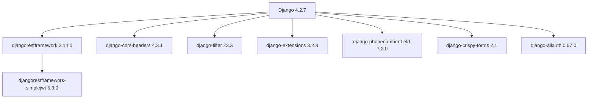
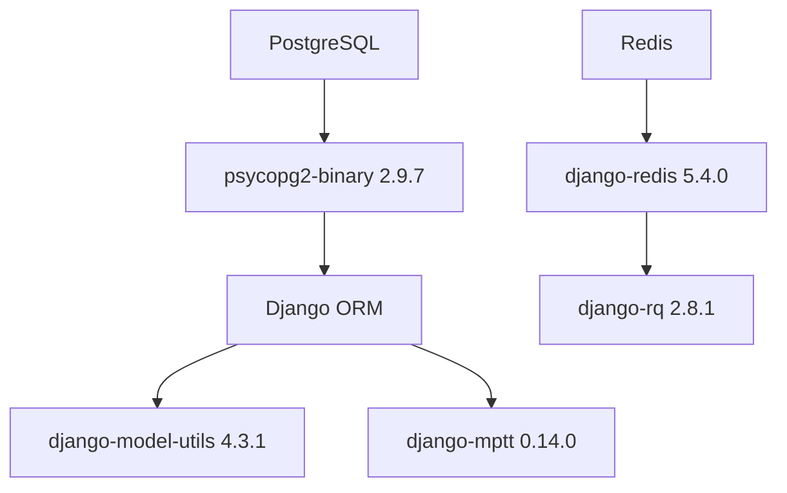
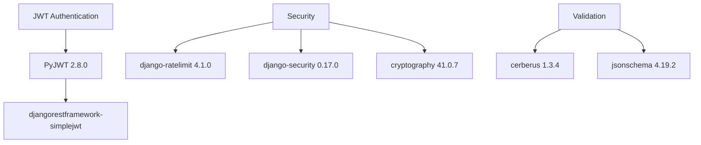
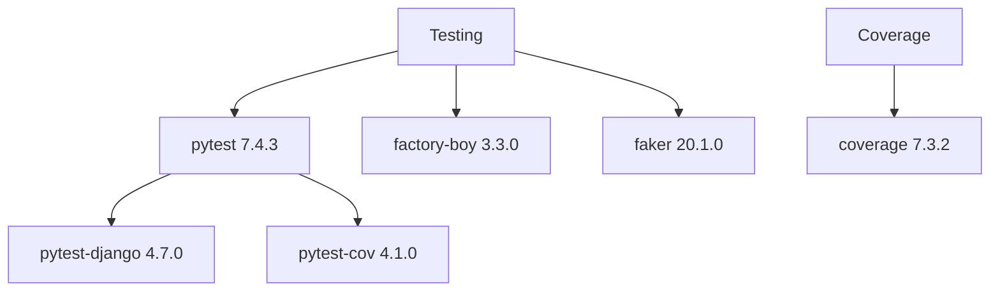
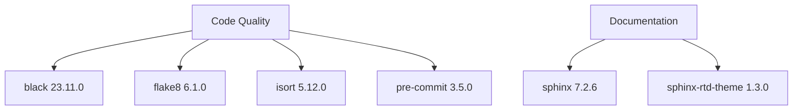
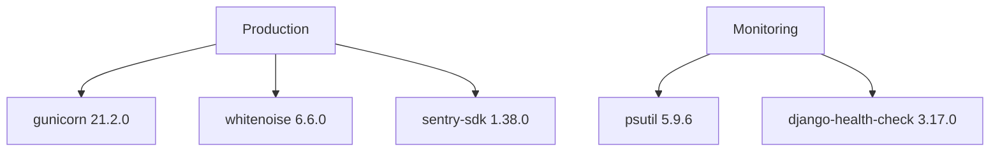
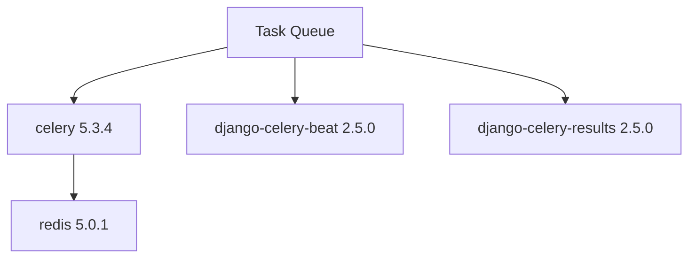
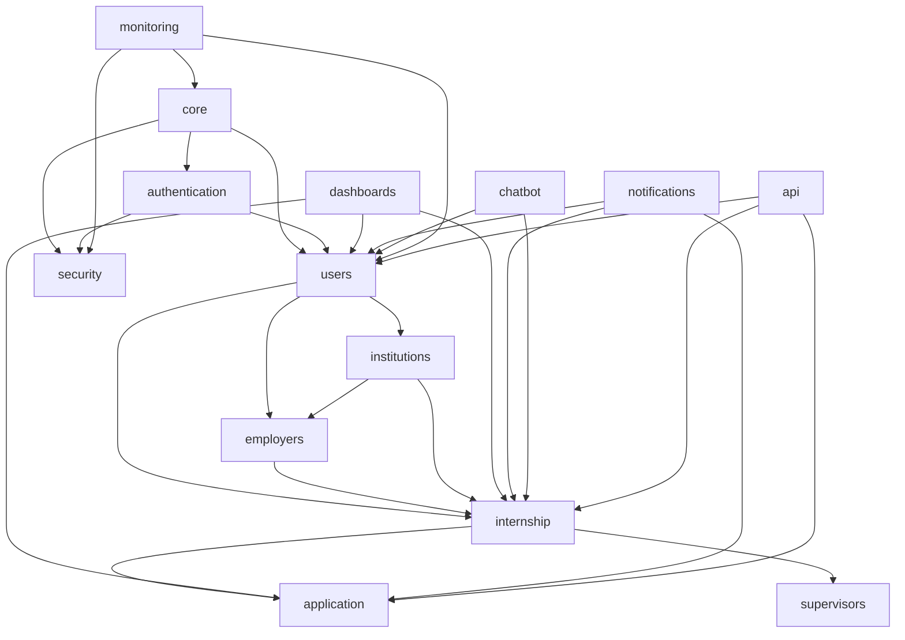

# Dependency Graphs & Package Relationships

## Edulink Internship Management Platform - Beta Version 1.0

### Overview

This document provides comprehensive dependency analysis for the Edulink platform, including internal module dependencies, external package relationships, and dependency management strategies.

---

## External Dependencies Analysis

### Core Framework Dependencies

#### Django Ecosystem


#### Database & ORM


#### Authentication & Security


### Development & Testing Dependencies

#### Testing Framework


#### Code Quality


### Production Dependencies

#### Web Server & Deployment


#### Background Tasks


---

## Internal Module Dependencies

### Application Dependency Graph



### Detailed Module Relationships

#### Core Dependencies
```python
# core/models.py dependencies
from django.db import models
from django.contrib.auth.models import AbstractUser
from django.utils import timezone
from model_utils.models import TimeStampedModel

# Internal dependencies
from .utils import generate_uuid
from .validators import validate_phone_number
```

#### Authentication Module
```python
# authentication/models.py dependencies
from django.contrib.auth import get_user_model
from rest_framework_simplejwt.tokens import RefreshToken
from django.contrib.auth.models import Permission

# Internal dependencies
from core.models import BaseModel
from users.models import User
from security.utils import hash_password
```

#### Users Module
```python
# users/models.py dependencies
from django.contrib.auth.models import AbstractUser
from phonenumber_field.modelfields import PhoneNumberField
from django.contrib.contenttypes.fields import GenericForeignKey

# Internal dependencies
from core.models import BaseModel, TimeStampedModel
from authentication.models import Role
```

#### Internship Module
```python
# internship/models.py dependencies
from django.db import models
from django.contrib.postgres.fields import ArrayField
from mptt.models import MPTTModel

# Internal dependencies
from core.models import BaseModel
from users.models import User, StudentProfile, EmployerProfile
from institutions.models import Institution
```

---

## Dependency Layers Architecture

### Layer 1: Foundation (No Internal Dependencies)
```
core/
├── models.py          # Base models, utilities
├── utils.py           # Helper functions
├── validators.py      # Custom validators
└── exceptions.py      # Custom exceptions
```

### Layer 2: Authentication & Security
```
authentication/        # Depends on: core
├── models.py
├── views.py
└── serializers.py

security/             # Depends on: core
├── models.py
├── middleware.py
└── utils.py
```

### Layer 3: User Management
```
users/                # Depends on: core, authentication
├── models/
├── views/
└── serializers/
```

### Layer 4: Business Logic
```
internship/           # Depends on: core, users
├── models/
├── views/
└── serializers/

employers/            # Depends on: core, users
├── models.py
├── views.py
└── serializers.py

institutions/         # Depends on: core, users
├── models.py
├── views.py
└── serializers.py
```

### Layer 5: Application Logic
```
application/          # Depends on: core, users, internship
├── models.py
├── views.py
└── serializers.py

supervisors/          # Depends on: core, users, internship
├── models.py
├── views.py
└── serializers.py
```

### Layer 6: Supporting Services
```
notifications/        # Depends on: core, users, internship, application
├── models.py
├── services.py
└── tasks.py

chatbot/             # Depends on: core, users, internship
├── models.py
├── ai_integration.py
└── views.py

dashboards/          # Depends on: core, users, internship, application
├── models.py
├── analytics.py
└── views.py
```

### Layer 7: Infrastructure
```
monitoring/          # Depends on: core, security
├── models.py
├── health_checks.py
└── metrics.py

api/                 # Depends on: all business logic layers
├── urls.py
├── views.py
└── serializers.py
```

---

## Package Version Matrix

### Critical Dependencies

| Package | Version | Security Level | Update Frequency | Breaking Changes Risk |
|---------|---------|----------------|------------------|-----------------------|
| Django | 4.2.7 | High | Monthly | Low |
| djangorestframework | 3.14.0 | High | Bi-monthly | Medium |
| psycopg2-binary | 2.9.7 | High | Quarterly | Low |
| celery | 5.3.4 | Medium | Quarterly | Medium |
| redis | 5.0.1 | Medium | Bi-annually | Low |
| PyJWT | 2.8.0 | High | Monthly | Medium |
| cryptography | 41.0.7 | Critical | Monthly | High |

### Development Dependencies

| Package | Version | Purpose | Update Frequency |
|---------|---------|---------|------------------|
| pytest | 7.4.3 | Testing | Quarterly |
| black | 23.11.0 | Code formatting | Monthly |
| flake8 | 6.1.0 | Linting | Quarterly |
| coverage | 7.3.2 | Test coverage | Quarterly |
| sphinx | 7.2.6 | Documentation | Bi-annually |

---

## Dependency Management Strategies

### Version Pinning Strategy

#### Production Dependencies
```python
# requirements.txt - Exact versions for production
Django==4.2.7
djangorestframework==3.14.0
psycopg2-binary==2.9.7
celery==5.3.4
redis==5.0.1
```

#### Development Dependencies
```python
# requirements-dev.txt - Compatible versions for development
pytest>=7.4.0,<8.0.0
black>=23.0.0,<24.0.0
flake8>=6.0.0,<7.0.0
coverage>=7.0.0,<8.0.0
```

### Update Management

#### Security Updates (Immediate)
```bash
# Check for security vulnerabilities
pip-audit
safety check

# Update security-critical packages
pip install --upgrade cryptography
pip install --upgrade django
```

#### Regular Updates (Monthly)
```bash
# Check outdated packages
pip list --outdated

# Update non-breaking packages
pip install --upgrade djangorestframework
pip install --upgrade celery
```

#### Major Updates (Quarterly)
```bash
# Test compatibility in development
pip install --upgrade django==5.0.0
python manage.py test

# Update after thorough testing
```

---

## Circular Dependency Prevention

### Design Patterns

#### 1. **Dependency Injection**
```python
# Instead of direct import
class InternshipService:
    def __init__(self, notification_service):
        self.notification_service = notification_service
    
    def create_internship(self, data):
        internship = Internship.objects.create(**data)
        self.notification_service.send_notification(internship)
        return internship
```

#### 2. **Event-Driven Architecture**
```python
# Using Django signals to decouple
from django.db.models.signals import post_save
from django.dispatch import receiver

@receiver(post_save, sender=Internship)
def internship_created(sender, instance, created, **kwargs):
    if created:
        # Trigger notification without direct dependency
        send_internship_notification.delay(instance.id)
```

#### 3. **Interface Segregation**
```python
# Define interfaces to break dependencies
from abc import ABC, abstractmethod

class NotificationInterface(ABC):
    @abstractmethod
    def send_notification(self, message):
        pass

class EmailNotificationService(NotificationInterface):
    def send_notification(self, message):
        # Implementation
        pass
```

### Dependency Validation

#### Static Analysis
```bash
# Check for circular imports
python -m py_compile **/*.py

# Use tools to detect circular dependencies
pip install pydeps
pydeps --show-deps --max-bacon=2 .
```

#### Runtime Validation
```python
# Custom management command to check dependencies
from django.core.management.base import BaseCommand
from django.apps import apps

class Command(BaseCommand):
    def handle(self, *args, **options):
        # Check for circular dependencies
        self.check_circular_dependencies()
```

---

## Performance Impact Analysis

### Import Time Analysis

#### Heavy Dependencies
```python
# Lazy imports for heavy packages
def get_ai_service():
    from google.generativeai import GenerativeModel
    return GenerativeModel('gemini-pro')

# Instead of global import
# import google.generativeai as genai  # Heavy import
```

#### Startup Time Optimization
```python
# Use lazy loading for non-critical imports
from django.utils.functional import LazyObject

class LazyAIService(LazyObject):
    def _setup(self):
        from .ai_service import AIService
        self._wrapped = AIService()

ai_service = LazyAIService()
```

### Memory Usage Analysis

#### Package Memory Footprint
| Package | Memory Usage | Load Time | Optimization |
|---------|--------------|-----------|-------------|
| Django | ~50MB | ~2s | Core framework |
| DRF | ~15MB | ~0.5s | Essential |
| Celery | ~25MB | ~1s | Background only |
| Pandas | ~100MB | ~3s | Lazy load |
| NumPy | ~80MB | ~2s | Analytics only |

---

## Security Dependency Analysis

### Vulnerability Scanning

#### Automated Security Checks
```yaml
# .github/workflows/security.yml
name: Security Scan
on: [push, pull_request]

jobs:
  security:
    runs-on: ubuntu-latest
    steps:
      - uses: actions/checkout@v2
      - name: Run safety check
        run: |
          pip install safety
          safety check -r requirements.txt
      - name: Run bandit
        run: |
          pip install bandit
          bandit -r . -f json
```

#### Security Policies
```python
# security/policies.py
SECURITY_POLICIES = {
    'critical_packages': [
        'django',
        'djangorestframework',
        'cryptography',
        'pyjwt',
    ],
    'update_frequency': {
        'critical': 'immediate',
        'high': 'weekly',
        'medium': 'monthly',
        'low': 'quarterly'
    }
}
```

### Dependency Isolation

#### Virtual Environment Strategy
```bash
# Production environment
python -m venv venv-prod
source venv-prod/bin/activate
pip install -r requirements.txt

# Development environment
python -m venv venv-dev
source venv-dev/bin/activate
pip install -r requirements-dev.txt

# Testing environment
python -m venv venv-test
source venv-test/bin/activate
pip install -r requirements-test.txt
```

---

## Monitoring & Alerting

### Dependency Health Monitoring

#### Package Version Tracking
```python
# monitoring/dependency_monitor.py
import pkg_resources
from django.core.management.base import BaseCommand

class Command(BaseCommand):
    def handle(self, *args, **options):
        installed_packages = [d for d in pkg_resources.working_set]
        
        for package in installed_packages:
            # Check for updates
            # Log version information
            # Alert on security vulnerabilities
            pass
```

#### Automated Alerts
```python
# monitoring/alerts.py
from celery import shared_task
from .dependency_monitor import check_vulnerabilities

@shared_task
def daily_security_check():
    vulnerabilities = check_vulnerabilities()
    if vulnerabilities:
        send_security_alert(vulnerabilities)
```

### Performance Monitoring

#### Import Time Tracking
```python
# monitoring/performance.py
import time
import importlib

def track_import_time(module_name):
    start_time = time.time()
    module = importlib.import_module(module_name)
    end_time = time.time()
    
    import_time = end_time - start_time
    log_import_performance(module_name, import_time)
    
    return module
```

---

## Migration & Upgrade Strategies

### Django Version Upgrades

#### Upgrade Path: Django 4.2 → 5.0
```python
# 1. Check compatibility
python manage.py check --deploy

# 2. Update dependencies
pip install django==5.0.0

# 3. Run tests
python manage.py test

# 4. Check for deprecation warnings
python -Wa manage.py test

# 5. Update code for breaking changes
# - Update URL patterns
# - Fix deprecated features
# - Update third-party packages
```

#### Rollback Strategy
```python
# requirements-rollback.txt
Django==4.2.7  # Previous stable version
djangorestframework==3.14.0
# ... other pinned versions

# Rollback command
pip install -r requirements-rollback.txt
python manage.py migrate
```

### Database Migration Dependencies

#### Migration Order
```python
# Ensure proper migration order
MIGRATION_DEPENDENCIES = {
    'users': ['core'],
    'authentication': ['core', 'users'],
    'internship': ['users'],
    'application': ['users', 'internship'],
    'notifications': ['users', 'internship', 'application']
}
```

---

## Best Practices

### Dependency Management

#### Do's
- ✅ Pin exact versions in production
- ✅ Use version ranges in development
- ✅ Regular security updates
- ✅ Test updates in staging first
- ✅ Document breaking changes
- ✅ Use virtual environments
- ✅ Monitor dependency health

#### Don'ts
- ❌ Don't use latest versions in production
- ❌ Don't ignore security warnings
- ❌ Don't update all packages at once
- ❌ Don't skip testing after updates
- ❌ Don't create circular dependencies
- ❌ Don't use deprecated packages
- ❌ Don't ignore compatibility warnings

### Code Organization

#### Dependency Injection
```python
# Good: Dependency injection
class InternshipService:
    def __init__(self, user_service, notification_service):
        self.user_service = user_service
        self.notification_service = notification_service

# Bad: Direct imports creating tight coupling
class InternshipService:
    def create_internship(self):
        from users.services import UserService
        from notifications.services import NotificationService
        # ...
```

#### Interface Design
```python
# Good: Abstract interfaces
from abc import ABC, abstractmethod

class StorageInterface(ABC):
    @abstractmethod
    def save_file(self, file_data):
        pass

# Bad: Concrete dependencies
from django.core.files.storage import default_storage
```

---

*Version: 1.0 - Beta Release*